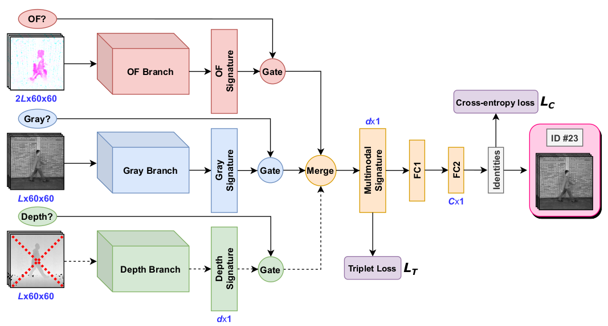
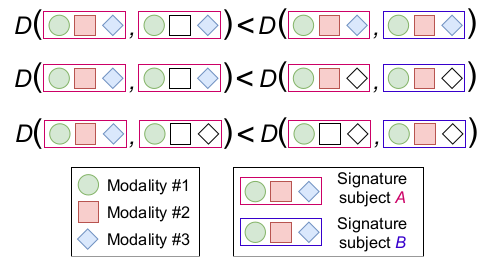

# GaitMiss: Multimodal gait recognition under missing modalities

Paper accepted for publication at [ICIP'2021](https://2021.ieeeicip.org/): [**read the preprint here**](http://www.uco.es/~in1majim/publications/gaitmiss_ICIP2021_draft.pdf).

__Code__: coming soon!

## Abstract
Multimodal systems for gait recognition have gained a lot of attention. However, there is a clear gap in the study of missing modalities, which represents real-life scenarios where sensors fail or data get corrupted. Here, we investigate how to handle missing modalities for gait recognition. We propose a single and flexible framework that uses a variable number of input modalities. For each modality, it consists of a branch and a binary unit indicating whether the modality is available; these are gated and merged together. Finally, it generates a single and compact ‘multimodal’ gait signature that encodes biometric information of the input. Our framework outperforms the state of the art on TUM-GAID and extensive experiments reveal its effectiveness for handling missing modalities even in the multiview setup of CASIA-B. 

## Proposed architecture

Input: (OF?, Gray?, Depth? ellipses) binary input units indicating whether the modality is available – here, depth is not available (dashed red cross); (volumes) sequences of _L_ frames for the different modalities. After fusing the single-modality signatures, a multimodal gait signature of _d_ dimensions is further compressed by FC1. The final FC2 contains _C_ classes (used just for training).  
The proposed model is depicted in the following figure:  

At training, the network learns multimodal signatures so that the distance _D_ between a pair of signatures of the same subject is lower than the distance between signatures of different subjects, independently of the modalities used to generate the signatures. To imitate test situations, some modalities are disabled (i.e. missing) at training (empty shapes).

## References
R. Delgado-Escaño, F. Castro, N. Guil, V. Kalogeiton, M. Marín-Jiménez. _"Multimodal gait recognition under missing modalities"_. IEEE ICIP, 2021
